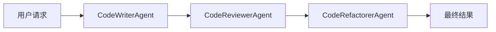
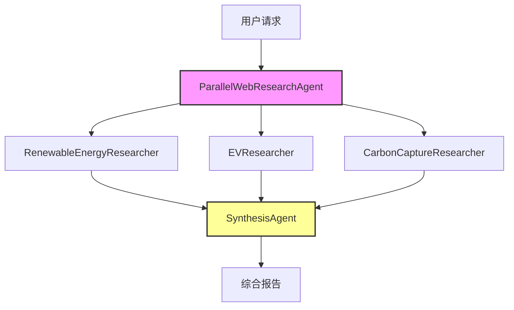
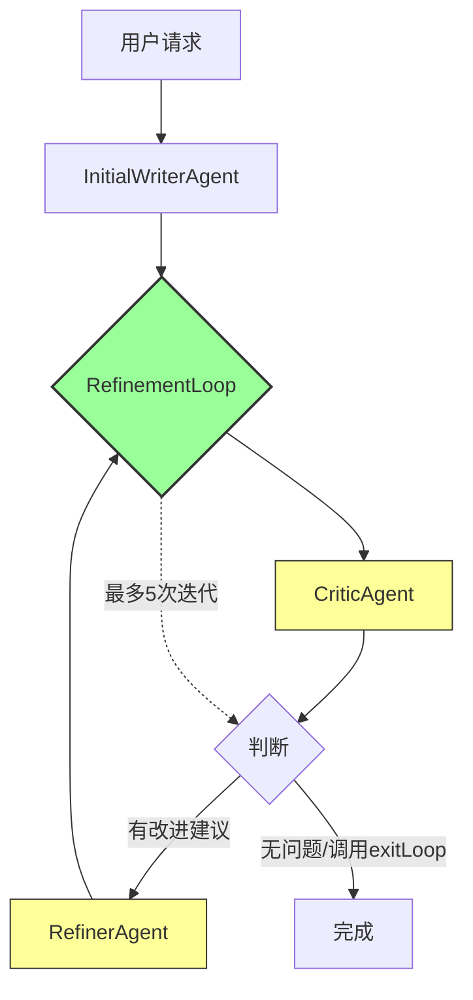

# Agent 执行顺序总结

本文档总结了 `com.jasonlat.ai.test.agent` 包下三个测试类的 Agent 执行模式和执行顺序。

---

## 1. SequentialAgentTest - 顺序执行代理

### 结构图

### 执行顺序

| 步骤 | Agent 名称 | 职责 |
|------|-----------|------|
| 1 | **CodeWriterAgent** | 根据用户需求编写初始 Java 代码，输出到 `generated_code` 状态 |
| 2 | **CodeReviewerAgent** | 审查生成的代码，提供改进建议，输出到 `review_comments` 状态 |
| 3 | **CodeRefactorerAgent** | 根据审查意见重构代码，输出到 `refactored_code` 状态 |

### 特点

- **严格顺序执行**：每个 Agent 必须等待前一个完成才能开始
- **状态共享**：通过 `outputKey` 将结果存储在状态中，供后续 Agent 使用
- **流水线模式**：代码生成 → 审查 → 重构，典型的流水线处理

---

## 2. ParallelAgentTest - 并行执行代理

### 结构图

### 执行顺序

| 阶段 | Agent 名称 | 职责 |
|------|-----------|------|
| 1 | **ParallelWebResearchAgent** (并行) | 同时运行三个研究代理 |
| 1.1 | `RenewableEnergyResearcher` | 研究可再生能源，输出到 `renewable_energy_result` |
| 1.2 | `EVResearcher` | 研究电动汽车技术，输出到 `ev_technology_result` |
| 1.3 | `CarbonCaptureResearcher` | 研究碳捕获方法，输出到 `carbon_capture_result` |
| 2 | **SynthesisAgent** | 整合三个研究结果，生成结构化报告 |

### 特点

- **并行执行**：三个研究代理同时运行，提高效率
- **结果聚合**：合成代理等待所有并行任务完成后，整合所有结果
- **独立状态**：每个并行代理有独立的状态存储键

---

## 3. LoopAgentTest - 循环执行代理

### 结构图

### 执行顺序

| 阶段 | Agent 名称 | 职责 |
|------|-----------|------|
| 1 | **InitialWriterAgent** | 编写初始文档草稿（仅执行一次），输出到 `current_document` 状态 |
| 2 | **RefinementLoop** (循环) | 循环精炼文档，最多 5 次迭代 |
| 2.1 | `CriticAgent` | 审查当前文档，提供改进建议或输出 "No major issues found."，输出到 `criticism` 状态 |
| 2.2 | `RefinerAgent` | 根据批评意见精炼文档，或调用 `exitLoop` 退出循环 |

### 循环退出条件

- **正常退出**：当 CriticAgent 输出 "No major issues found." 时，RefinerAgent 调用 `exitLoop` 工具退出循环
- **强制退出**：达到最大迭代次数（5 次）

### 特点

- **混合模式**：顺序执行初始写作 + 循环精炼
- **条件退出**：通过工具调用实现循环退出控制
- **状态迭代**：`current_document` 在每次迭代中被更新

---

## 总结对比

| 特性 | SequentialAgentTest | ParallelAgentTest | LoopAgentTest |
|------|---------------------|-------------------|---------------|
| **执行模式** | 顺序 | 并行 + 顺序 | 循环 + 顺序 |
| **Agent 数量** | 3 | 4 (3并行+1合并) | 4 (1初始+2循环+1循环体) |
| **状态管理** | 线性传递 | 并行收集+聚合 | 迭代更新 |
| **典型场景** | 流水线处理 | 多源信息收集 | 迭代优化任务 |

### 核心概念

1. **SequentialAgent**：按顺序执行子代理，每个完成后才开始下一个
2. **ParallelAgent**：同时执行所有子代理，等待全部完成后进入下一阶段
3. **LoopAgent**：循环执行子代理，直到满足退出条件或达到最大迭代次数
